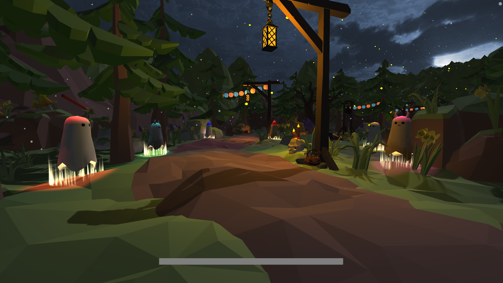
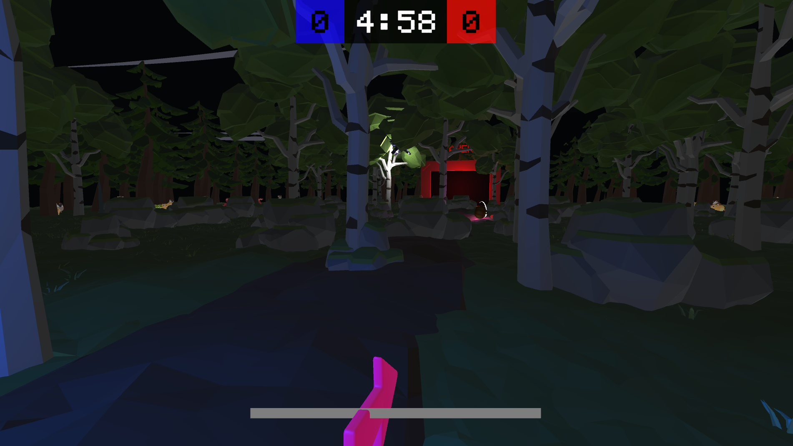
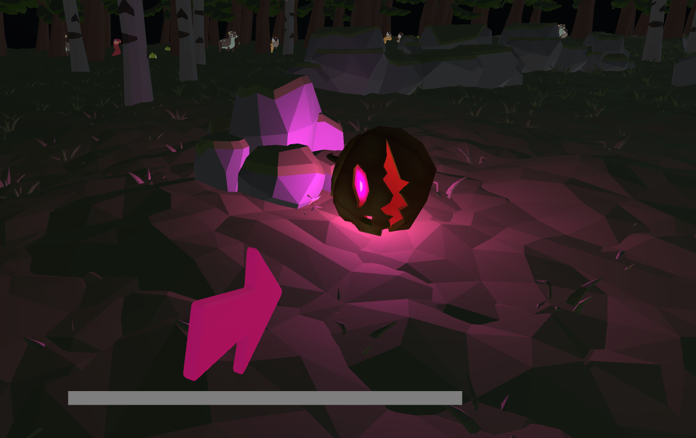
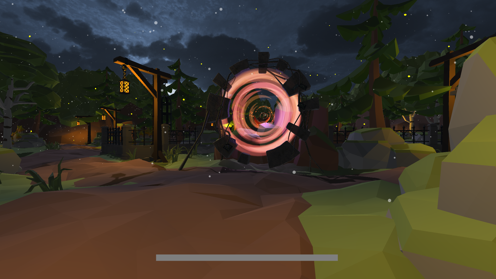

### Ghosts Hallows   
Ghosts Hallows is a 2 weeks game we made to learn Unity's physics engine.   
We had to use an Halloween theme and it came out as a FPS Splitscreen multiplayer.   

## GOAL
The goal is simple : You have to push and project the ball in the opposite goal while a drone take and fly away with the ball.   

## Screenshots :   

